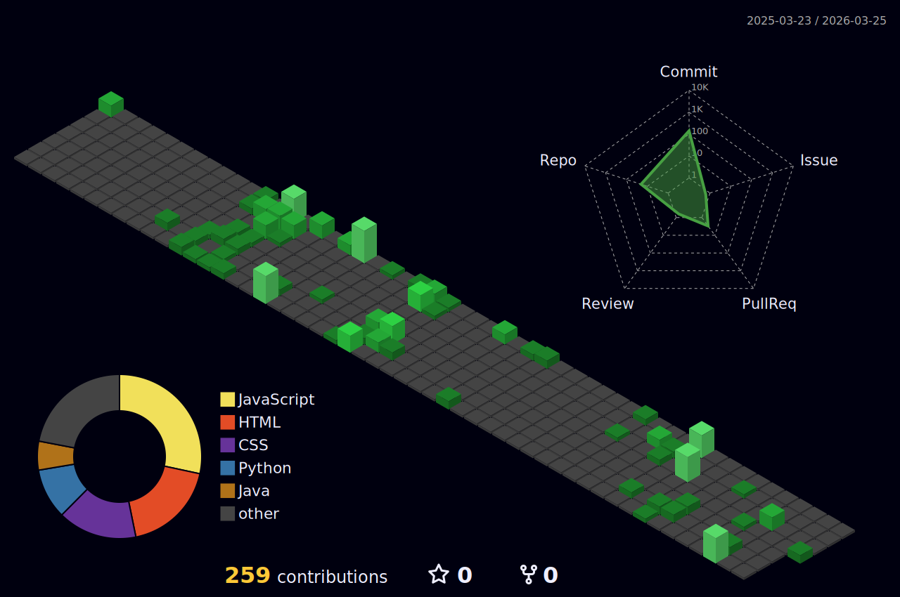

## Hi there 👋

<!--
**CereenaG/CereenaG** is a ✨ _special_ ✨ repository because its `README.md` (this file) appears on your GitHub profile.

Here are some ideas to get you started:

- 🔭 I’m currently working on ...
- 🌱 I’m currently learning ...
- 👯 I’m looking to collaborate on ...
- 🤔 I’m looking for help with ...
- 💬 Ask me about ...
- 📫 How to reach me: ...
- 😄 Pronouns: ...
- ⚡ Fun fact: ...

 🌱I'm currently learning Java for backend development along with frontend technologies.-->
 
<!--START_SECTION:waka-->

```txt
Total Time: 42 hrs 48 mins

Java             13 hrs 19 mins  ███████▓░░░░░░░░░░░░░░░░░   31.12 %
JavaScript       12 hrs 28 mins  ███████▒░░░░░░░░░░░░░░░░░   29.15 %
CSS              10 hrs 40 mins  ██████▒░░░░░░░░░░░░░░░░░░   24.94 %
HTML             3 hrs 58 mins   ██▒░░░░░░░░░░░░░░░░░░░░░░   09.29 %
Markdown         1 hr 5 mins     ▓░░░░░░░░░░░░░░░░░░░░░░░░   02.54 %
```

<!--END_SECTION:waka-->

