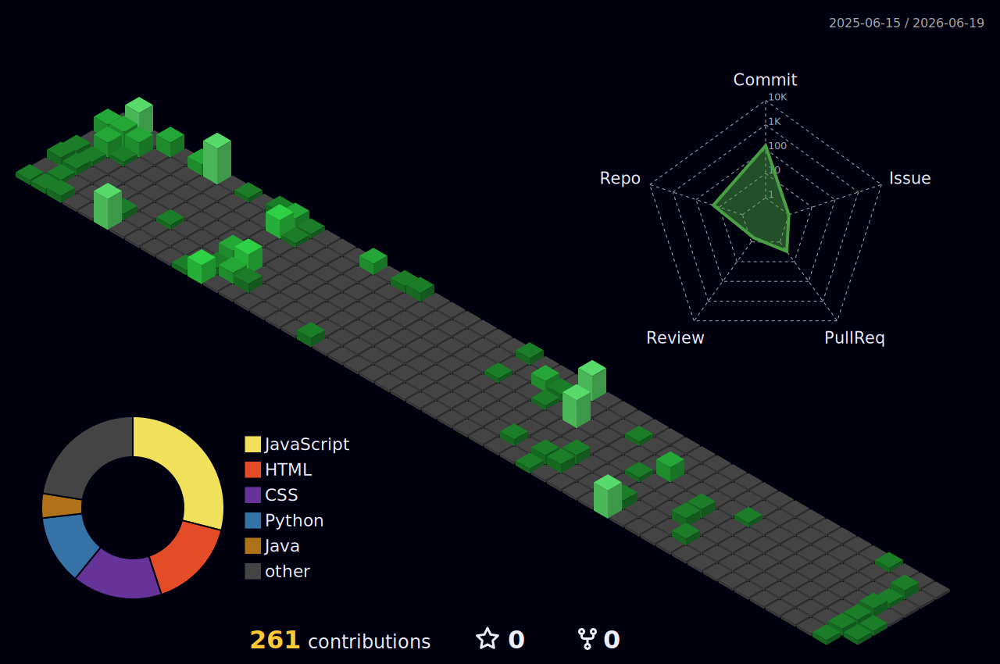

## Hi there 👋

<!--
**CereenaG/CereenaG** is a ✨ _special_ ✨ repository because its `README.md` (this file) appears on your GitHub profile.

Here are some ideas to get you started:

- 🔭 I’m currently working on ...
- 🌱 I’m currently learning ...
- 👯 I’m looking to collaborate on ...
- 🤔 I’m looking for help with ...
- 💬 Ask me about ...
- 📫 How to reach me: ...
- 😄 Pronouns: ...
- ⚡ Fun fact: ...

 🌱I'm currently learning Java for backend development along with frontend technologies.-->
 
<!--START_SECTION:waka-->

```txt
Total Time: 87 hrs 3 mins

Java              28 hrs 51 mins        ████████▒░░░░░░░░░░░░░░░░   33.14 %
JavaScript        19 hrs 7 mins         █████▒░░░░░░░░░░░░░░░░░░░   21.97 %
CSS               15 hrs 35 mins        ████▒░░░░░░░░░░░░░░░░░░░░   17.92 %
HTML              11 hrs 30 mins        ███▒░░░░░░░░░░░░░░░░░░░░░   13.22 %
Python            2 hrs 13 mins         ▓░░░░░░░░░░░░░░░░░░░░░░░░   02.55 %
```

<!--END_SECTION:waka-->
<!---->


